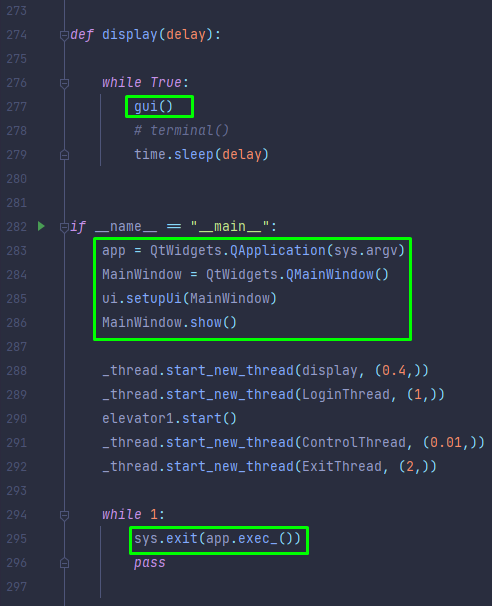
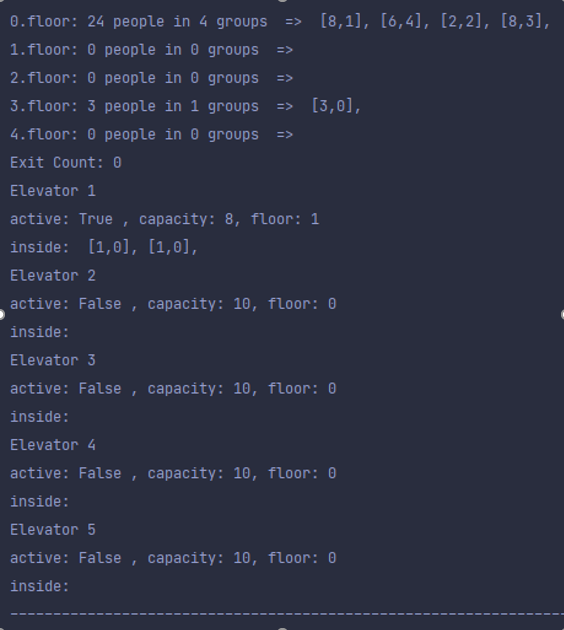
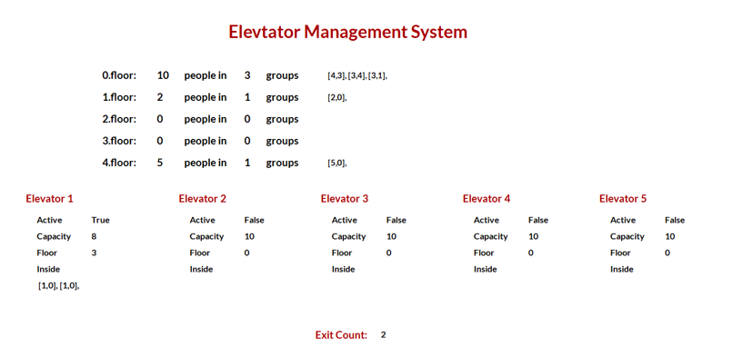

=== Elevator Management System

There are four main threads called Login, Exit, Elevator, and Control.

*Login Thread:* This thread periodically adds a group of people between 1-10 to the elevator queue to go any floor between 1-4.

*Exit Thread:* This thread periodically adds a group of people between 1-5 to the elevator queue from any floor between 1-4 to leave the mall.

*Elevator Thread:* This thread periodically moves between the floors and carries groups of people.

*Control Thread:* This thread checks all elevator queues and set active or deactivates other elevators based on the queue density.

There are two options to monitor outputs;

You can comment out the lines marked with green and uncomment line 278 to make changes between output options.

*1-Terminal*

*2-Graphical User Interface*

Developed on PyCharm IDE and used PyQt5 for the graphical user interface.